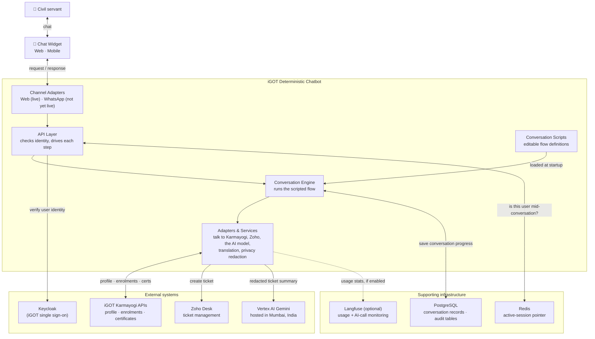
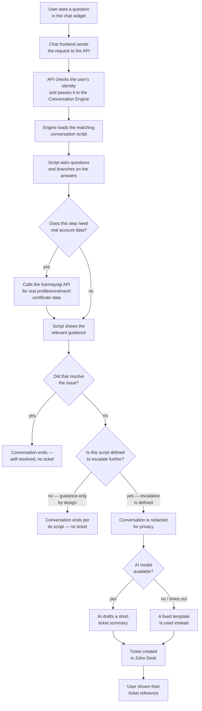

# iGOT Deterministic Chatbot — High-Level Design (HLD)

> **Audience**: this document is written for everyone with a stake in the system —
> product managers, architects, engineers joining the team, reviewers, and integration
> partners. It stays at the level of "what does the system do and how are the pieces
> connected," not "which file does what." For flow-authoring detail and day-to-day
> developer workflow, see the Technical Design Document. For the exact API contract a
> frontend team integrates against, see the Frontend Integration Contract.

---

## Table of Contents

1. [Purpose & Scope](#1-purpose--scope)
2. [System Architecture](#2-system-architecture)
3. [Data & Data Flow](#3-data--data-flow)
4. [Systems, Services, Platforms & Relationships](#4-systems-services-platforms--relationships)
5. [Interfaces](#5-interfaces)
6. [User Workflow](#6-user-workflow)
7. [Key Performance & Non-Functional Considerations](#7-key-performance--non-functional-considerations)
8. [Appendix — Technology Choices](#8-appendix--technology-choices)

---

## 1. Purpose & Scope

The iGOT Deterministic Chatbot is a support-automation service for **iGOT Karmayogi Bharat**,
India's national civil-services learning platform. It resolves high-volume, repetitive L1
support queries — certificate issues, course progress, profile completion, karma points, and
similar — by walking the user through a **scripted, step-by-step conversation** instead of
letting an AI model freely decide what happens next. An AI model is used in exactly one place:
to turn a conversation the script couldn't resolve into a readable support-ticket summary. Even
that step has an automatic, non-AI fallback, so raising a ticket never depends on the AI model
being available.

**In scope for this document:** the chatbot service itself — how it's put together, what data
it holds, and how it talks to the outside world.
**Out of scope:** the internal architecture of the iGOT portal, Zoho Desk, and Keycloak — these
are treated as external systems the chatbot talks to over a defined contract. **The production
chat widget that would actually appear inside the iGOT portal is also out of scope** — it isn't
part of this service. It is built separately by a frontend team against the Frontend
Integration Contract, and whether that build is complete is not something this document can
confirm. A simple internal testing page exists purely so engineers can try out conversation
flows during development; it is not the production widget and is switched off outside
development/staging environments.

---

## 2. System Architecture

### 2.1 Architecture diagram

One diagram, covering both the internal pieces and what they connect to outside:



> Two things are intentionally left off this diagram to keep it readable: automatic language
> translation (so users can chat in their preferred Indian language) and additional channels
> like voice. Translation is real and already working — see [§5](#5-interfaces). Voice is not
> live yet; see [§5.3](#53-user-interfaces).

### 2.2 Component responsibilities

| Component | What it does | Why it's needed |
|---|---|---|
| **API Layer** | The front door. Receives every chat request, checks the user's identity, drives one step of the conversation forward, and sends back the reply. | Every request has to land somewhere safe and consistent — this is the one place that checks "is this a real, logged-in user?" before anything else happens. |
| **Conversation Engine** | Reads the conversation scripts and runs them — asking questions, branching on answers, calling out for data, deciding when to raise a ticket. | This is what makes the bot "deterministic" — it always follows the script exactly, so the same input always leads to the same, auditable outcome. |
| **Adapters & Services** | The connectors to everything outside the engine — Karmayogi, Zoho, the AI model, translation, and a privacy-redaction step. | Keeps all the messy details of talking to outside systems in one place, so the conversation scripts stay simple and the engine doesn't need to know how each external system works. |
| **Channel Adapters** | Adjusts the bot's generic output (messages, buttons, lists) to fit the rules of a specific channel — e.g. WhatsApp only allows 3 quick-reply buttons at once. | Lets the same conversation script work across different channels without being rewritten for each one. Only the web/mobile adapter is live today. |
| **Conversation Scripts** | The actual step-by-step definitions of each support conversation, written in a simple format, plus reusable building blocks for common sub-steps (raising a ticket, closing messages, etc). | This is what lets the support team change or add a conversation without needing an engineer to write code or ship a release. |

> A file-by-file, module-by-module breakdown (specific code modules, function names, and any
> known dead code) belongs in the Low-Level Design, not here.

---

## 3. Data & Data Flow

### 3.1 Storage overview

The system uses **two different stores for two different jobs**, plus one optional third for
observability:

| Store | Holds | Why this store |
|---|---|---|
| **PostgreSQL** (main database) | The full record of every conversation — its history, current step, and outcome — plus a log of technical escalations raised for the engineering team | Durable — survives a restart or redeploy without losing anyone's conversation |
| **Redis** (fast lookup cache) | A pointer only — "which conversation is this user currently in?" — never the conversation content itself | Optimised for a quick "do you have an active conversation?" check across devices; disposable — if it's ever unavailable, the user simply starts a new conversation instead of resuming one |
| **Langfuse** (optional, self-hosted observability) | A sampled trace of conversation steps and AI-model usage, kept separately from the actual conversation data | Isolated from application data; only turned on when usage monitoring is enabled |

> **Note:** an earlier design draft planned to use Redis as the primary store for full
> conversation state. The system as built instead uses PostgreSQL as the single source of truth
> for conversation state, with Redis reduced to a lightweight pointer. This document reflects
> that as-built decision.

### 3.2 What's stored, conceptually

Three things, in plain terms:

- **Conversation records** (in PostgreSQL) hold everything needed to resume a conversation
  exactly where it left off: who the user is (in anonymised form — see "Privacy protection" in
  [§7](#7-key-performance--non-functional-considerations)), which script they're in, what step
  they're on, what information has been collected so far, and the eventual outcome
  (self-resolved, ticket raised, etc).
- **Engineering escalations** (also in PostgreSQL) is a simple, separate log used only by
  specific flows that need to hand a technical issue to the engineering team directly, rather
  than through Zoho Desk. Schema/migration tooling for this table is not yet formally set up —
  today it is created automatically the first time the service starts.
- **The active-session pointer** is the only thing that lives in Redis. No conversation content
  is ever stored there — only a pointer to where the real record lives in PostgreSQL.

### 3.3 High-level data flow (one conversation step)

What happens, step by step, for a single conversation turn:

1. The chat widget sends the user's action to the chatbot backend.
2. The backend loads that user's conversation record from PostgreSQL.
3. If the message isn't in English, it's translated to English first.
4. The conversation engine resumes the script from wherever it left off, and keeps running
   steps until it next needs the user's input. Along the way it may:
   - call out to Karmayogi or Zoho for data or to raise a ticket, and/or
   - escalate to Vertex AI Gemini for a ticket summary (redacted first for privacy), with a
     template used instead if that call fails.
5. The engine hands back the next messages/buttons to show.
6. The reply is translated back into the user's language, if needed.
7. The backend saves the updated conversation record to PostgreSQL and refreshes the
   active-session pointer in Redis.
8. The reply is shown to the user.

**Data flow, summarized in plain terms:**

```
Chat Widget → Chatbot Backend → Translation (if not English) → Conversation Engine
   Engine → runs the current script step → calls out to Karmayogi / Zoho / Vertex AI Gemini as needed
   Engine → updates the conversation record → saved to PostgreSQL after every step
   Engine → next reply → translated back → Chatbot Backend → Chat Widget
   Chatbot Backend → also refreshes the active-session pointer in Redis, independent of the engine itself
   Escalation step → privacy redaction → Vertex AI Gemini → optional Langfuse trace, if monitoring is on
```

---

## 4. Systems, Services, Platforms & Relationships

| System / Service | Type | Relationship to the chatbot |
|---|---|---|
| **iGOT Karmayogi portal APIs** | External platform | Source of truth for user profile, enrolments, and certificates. The chatbot mostly reads from it; it only writes back through a small number of well-defined actions (e.g. unenrolling from a course). |
| **Keycloak** (iGOT single sign-on) | External identity service | Issues the user's session token when they open the portal. The chatbot verifies that token on every request and never stores the raw token beyond the active conversation. |
| **Zoho Desk** | External ticketing platform | The system of record for any issue the scripted conversation can't resolve on its own. |
| **Vertex AI Gemini** (hosted in Mumbai) | External AI service | Used in exactly one place: turning a redacted conversation into a support-ticket summary when escalation is needed — at most once per conversation, with a template fallback and an operator-controlled switch to disable it instantly if ever needed. It also powers the translation step described below. |
| **Translation providers** | External services (Gemini as primary, plus two fallback providers) | Automatically translate the user's message into English before the conversation engine sees it, and translate the bot's reply back into the user's language. If every provider fails, the user simply sees the English text rather than the conversation breaking. |
| **PostgreSQL** | Shared infrastructure | Holds the durable conversation record and the engineering-escalation log; can optionally also host Langfuse's own data. |
| **Redis** | Shared infrastructure | Holds only the active-session pointer described in [§3](#3-data--data-flow); entirely optional — if it's unavailable, users simply start fresh conversations instead of resuming. |
| **Langfuse** (optional, self-hosted) | Monitoring platform | Records a sampled trace of conversation steps and AI-model usage (cost, latency) for monitoring purposes; not the system of record for anything. |
| **Privacy redaction step** | Internal, in-process only — not a separate service | Strips a defined set of sensitive personal information (ID numbers, phone numbers, email addresses) out of any text before it is ever sent to Vertex AI Gemini. Today this is a straightforward pattern-matching implementation rather than a full third-party redaction library — functionally in place, but a simpler version than the eventual target. |
| **Web / mobile chat widget** | Client application, **built outside this service** | Would render the chatbot's replies inside the iGOT portal. The chatbot's own web-facing component is ready for this today; whether the actual portal-side widget has been built and connected is a separate workstream and isn't confirmed from this side. A simple internal test page exists for development use only and is not that production widget. |

**Relationship summary:** the chatbot keeps no meaningful state in its own running process —
everything durable lives in PostgreSQL and Redis, identity lives with Keycloak, learner data
lives with Karmayogi, and escalations live with Zoho. This lets the service scale out
horizontally (any instance can serve any conversation) and lets each external system evolve on
its own schedule.

---

## 5. Interfaces

### 5.1 Infrastructure interfaces

The service has no special hardware requirements — it runs as a standard containerized
workload alongside the rest of Karmayogi's infrastructure:

| Layer | Detail |
|---|---|
| **Compute** | Runs in a standard container, scaled by adding more instances rather than by making a single instance bigger. |
| **Orchestration** | Runs on the existing Kubernetes cluster used by the rest of Karmayogi, with a standard health-check endpoint. |
| **Database** | Uses Karmayogi's existing shared PostgreSQL cluster — no dedicated hardware. |
| **Cache** | Uses a shared, modestly-sized Redis instance — sized independently per environment. |
| **Region / data residency** | Vertex AI Gemini and translation calls are pinned to a Mumbai-based region for India data residency; PostgreSQL and Redis already run on Karmayogi's India-hosted infrastructure. |

### 5.2 Software interfaces (APIs)

The chatbot exposes a request/response API over the web, consumed by the chat widget — the
Frontend Integration Contract has the full specification:

| Operation | Purpose |
|---|---|
| Health check | Confirms the service is running |
| Start a conversation | Begins a new session and returns the greeting plus a menu of topics |
| Submit a user action | Advances the conversation by one step and returns the bot's next reply |
| Resolve the active conversation | Lets a returning user's app find their in-progress conversation |
| Fetch conversation history | Returns the full transcript so far, for resuming a conversation |
| Admin: conversation trace *(planned, not yet available)* | A detailed step-by-step debug view for support staff |
| Admin: delete a conversation *(planned, not yet available)* | Supports a user's right to have their data erased |

The chatbot also acts as a client to a handful of outbound services: the Karmayogi platform
(to read profile/enrolment/certificate data), Zoho Desk (to raise tickets), Vertex AI Gemini
(for ticket summaries), the translation providers, and Keycloak (to verify sessions).

Separately, the conversation scripts themselves are a kind of interface: they are written in a
simple, declarative format that non-developers can read and edit — adding a new support flow,
changing what a ticket contains, or editing the bot's wording does not require an engineering
release. See the Technical Design Document for the full authoring guide.

### 5.3 User interfaces

The chatbot has no interface of its own; it produces a channel-neutral set of reply elements —
plain text, formatted text, buttons, searchable lists, free-text prompts, and a small number of
other standard elements — which each channel then renders in a way that fits that channel:

- **Web/mobile** — the chatbot's side of this is ready and live today. The actual production
  widget that would sit inside the iGOT portal is built by a separate frontend team and is not
  part of this service; whether it has been built and connected is not something this document
  can confirm.
- **An internal test page** exists purely so engineers can try out conversation flows during
  development. It only runs in development/staging environments and is explicitly switched off
  in production — it should not be read as a preview of, or stand-in for, the real portal
  widget.
- **WhatsApp** — planned but not live. The groundwork for WhatsApp's stricter UI limits (for
  example, its 3-button maximum) is already built into the system, but there is no working
  WhatsApp channel today.
- **Voice / IVR** — not yet built; a possible future channel.

---

## 6. User Workflow

### 6.1 Conversation state machine

Every conversation moves through a small set of stages, in order:

1. **Selecting a category** — the conversation starts here; the user picks a broad topic.
2. **Selecting a topic** — the user picks the specific issue within that category.
3. **In progress** — the script runs: asking questions, showing guidance, looping back here
   after each answer until it reaches an outcome.
4. **Escalating** *(only if needed)* — the script hands off to the AI model for a ticket
   summary, then returns to "in progress" once the user confirms it.
5. **Done** — the conversation reaches an outcome (self-resolved, ticket raised, etc.) and ends.

A conversation can also end early from "in progress" if it times out from inactivity — the
user simply sees a "let's start fresh" message instead of reaching "done."

### 6.2 Overall conversation workflow — question to ticket (or not)

This is the one diagram that ties everything together: how a user's question travels from the
chat widget, through the conversation script, out to Karmayogi and/or Zoho, and ends either as
a self-resolved answer or a ticket — and, importantly, that the AI-escalation and ticket-raising
steps only ever run for conversations that are specifically **defined** to use them. A plain
guidance flow (like "why isn't the leaderboard updating") simply ends when its script says so,
with nothing further happening.



A few things worth calling out about this diagram:

- **Karmayogi is read-only here** — it's only ever consulted to check the user's real status,
  never to make the routing decision itself.
- **The "escalate further?" branch is decided per conversation script, not globally** — some
  support topics are written to always end with guidance only (no ticket needed, per the
  support team's own rules for that topic); others are written to escalate to the AI model and
  Zoho Desk if the guidance alone doesn't resolve things. Both are equally valid, intentional
  outcomes — not one being "incomplete."
- **The AI model only ever writes the ticket wording** — it never decides whether to escalate,
  and it's never on the path for a conversation that ends without one.

### 6.3 Use case 1 — Certificate download issue (follows the escalation path)

A real, live support flow that walks the full path above, including the escalation branch.

```
1. User opens the widget → picks "Certificate issue" from the topic menu
2. Bot asks what's wrong: certificate not generated, or wrong name on it?
3. Bot asks which course, then calls the Karmayogi API to check that course's
   enrolment and certificate status
4. Based on the real status returned by Karmayogi, the bot shows the relevant
   guidance:
     - certificate already generated → shows the download steps
     - still processing → tells the user to check back after 24 hours
     - course not actually completed → explains what's still missing
5. If none of that resolves it, this script is defined to escalate — so the bot
   automatically redacts the conversation, gets an AI-drafted (or template)
   ticket summary, and raises the ticket in Zoho Desk with no extra confirmation
6. Conversation ends, showing the user their ticket reference
```

**Components involved:** Chat Widget → API Layer → Conversation Engine → Karmayogi API (to
check real enrolment/certificate status) → Conversation Scripts (the actual questions and
guidance) → Privacy redaction + Vertex AI Gemini (only because this script is defined to
escalate) → Zoho Desk (to create the ticket).

### 6.4 Use case 2 — Leaderboard not updating (ends without escalation, by design)

Not every conversation needs any of the integrations above, and not every unresolved issue
needs a ticket — this script is deliberately written to end with guidance only.

```
1. User opens the widget → picks "Leaderboard issue" from the topic menu
2. Bot asks: can't find the leaderboard, or it's visible but not updated?
3. Bot gives a short, fixed answer — e.g. "the leaderboard refreshes once a
   month, on the 1st; check back after that"
4. Conversation ends — this topic's script is defined as guidance-only, so
   there's no escalation step and no ticket, by design, not because anything
   is missing
```

**Components involved:** Chat Widget → API Layer → Conversation Engine → Conversation Scripts
only. No Karmayogi call, no AI model, no Zoho ticket — the script's own built-in knowledge is
enough to answer the question, so nothing else needs to run.

### 6.5 Cross-device resume workflow

```
App opens → checks for an active conversation for this user
  → found → fetches the full conversation history and shows it,
             with the last bot message as the current prompt
  → not found (new user, expired, or lookup temporarily unavailable)
       → starts a fresh conversation
```

### 6.6 Scalability plan

How this architecture is expected to grow, without needing to be rebuilt:

- **More conversations, more users:** the service holds no per-user state of its own — it's
  all in PostgreSQL and Redis — so handling more traffic is just a matter of running more
  copies of the service side by side. No architectural change needed.
- **More support topics:** because every conversation is a configuration file rather than
  code, the support team can add dozens more topics over time without any of them needing an
  engineering release or a redeploy.
- **More channels:** the channel-adapter layer (§2.2) already separates "what the bot says"
  from "how a specific channel displays it." WhatsApp's groundwork already exists; adding it,
  or a future voice channel, means writing one new adapter — not touching the conversation
  engine or any existing script.
- **AI cost stays bounded as usage grows:** the AI model is capped at roughly one call per
  conversation and only used as a last resort, with an instant kill-switch if costs or
  availability ever become a concern — so AI cost grows far slower than conversation volume.
- **Swappable AI provider:** the system already supports pointing at a different AI model
  (including a self-hosted option) without changing the conversation engine or any script,
  in case requirements around cost, performance, or hosting change later.

---

## 7. Key Performance & Non-Functional Considerations

| Concern | Design response |
|---|---|
| **Latency (no external call)** | Purely scripted steps (asking a question, branching on an answer) are near-instant — target well under a quarter of a second per step. |
| **Latency (with a data lookup)** | Steps that call out to Karmayogi or Zoho carry a per-step timeout; target a few seconds at most, including that round trip. |
| **Latency (AI-assisted step)** | The AI-summary step has a short timeout; if it's exceeded, the template fallback fires immediately rather than making the user wait. |
| **Cost control** | The AI model is used at most once per conversation by default, enforced in the system itself; an operator-controlled switch can disable AI calls instantly, with no redeploy needed. No automated spend-based alerting exists today. |
| **Availability of the AI-assisted path** | Every AI-model call has a non-AI fallback — raising a ticket never blocks on the AI model being available. |
| **Availability of Redis** | Designed to fail open — if it's ever unreachable, the worst case is a user starting a fresh conversation instead of resuming one, never a hard error. |
| **Availability of PostgreSQL** | The system can temporarily fall back to keeping conversation state in memory if the database is briefly unreachable at startup, trading durability for continued availability in that degraded case only. |
| **Horizontal scalability** | The service itself holds no session-specific state between requests — everything durable lives in the shared database and cache — so any running instance can serve any conversation, and capacity is added simply by running more instances. |
| **Auditability** | Every conversation's full step-by-step path and message log is saved to the database; the optional observability platform adds a separate, sampled view for monitoring, without being the system of record. |
| **Privacy protection** | The user's identity is one-way hashed at the point of entry — the raw user ID is never stored. A redaction step strips defined categories of sensitive personal information (ID numbers, phone numbers, email addresses) out of any text before it reaches the AI model. This redaction is currently a straightforward, pattern-based implementation rather than a full third-party privacy-redaction library — real and active, but simpler than the long-term target. Purely scripted conversations are also prevented, by design, from ever calling the AI model at all. |
| **Data residency** | AI-model and translation calls are pinned to a Mumbai-based region; supporting infrastructure already runs on Karmayogi's existing India-hosted cluster. |
| **Session experience** | A conversation stays open for 30 minutes of inactivity on the web/mobile channel (the only live channel today), refreshed on every turn; on timeout, the user sees a clean "let's start fresh" message rather than stale or expired information. A longer timeout window is already configured in anticipation of a future WhatsApp channel, but has no effect until that channel exists. |
| **Change velocity for non-developers** | Adding or changing a support conversation — its questions, its ticket content, its wording — is a configuration-only change that doesn't require an engineering release. Checking that a change is valid before it ships is currently a manual step for the engineer making the change, not yet an automatic gate. |
| **Quality assurance leverage** | Before a new or changed conversation ships, an automated tool walks every possible path through it and has an AI model judge whether each path matches the intended support script — catching mistakes before they reach real users. |

---

## 8. Appendix — Technology Choices

For those who want to know what the system is actually built on, at a glance:

| Layer | Technology |
|---|---|
| Programming language | Python |
| Web framework | FastAPI |
| Conversation engine | LangGraph (an open-source conversation/workflow engine) |
| Database | PostgreSQL |
| Fast lookup cache | Redis |
| Conversation script format | YAML (a simple, human-readable configuration format) |
| Message templating & rules | A sandboxed templating engine plus a restricted, safe rule-evaluation engine (no arbitrary code execution) |
| AI model | Google Vertex AI, Gemini 2.5 Flash, hosted in Mumbai for India data residency; an alternative self-hosted model path exists in the system but is not the deployed default |
| Translation | Google Gemini (primary) → Google Cloud Translation (fallback) → Bhashini, a government-run India-language service (last resort) |
| Privacy redaction | A pattern-based redaction step today; a full third-party redaction library is planned but not yet active |
| Observability | An optional, self-hosted monitoring platform for AI-model usage; standard application logging |
| Authentication | Token-based, verified against Keycloak (iGOT's existing identity provider) |
| Deployment | Standard containers, run on the existing Kubernetes infrastructure |
| Continuous integration | Automated build only today; flow validation and AI-judged quality checks are run manually by engineers before a change ships, not yet gated automatically in the build pipeline |
